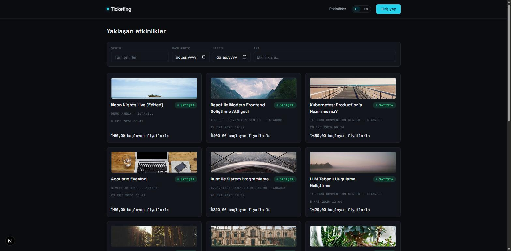
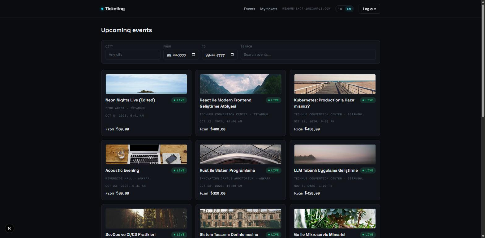
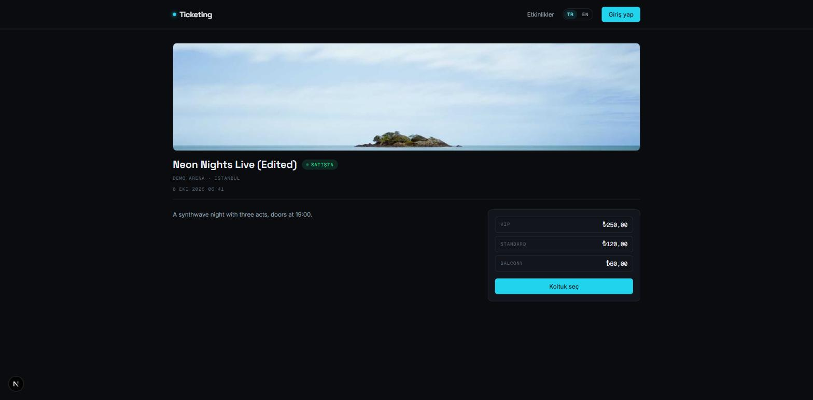
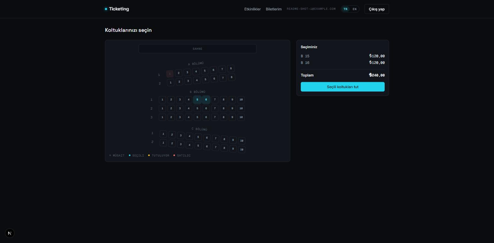
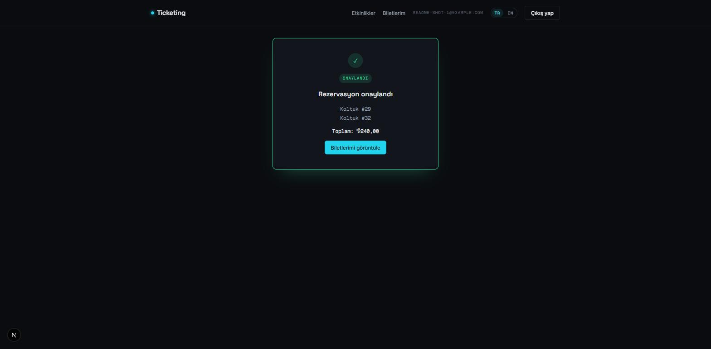
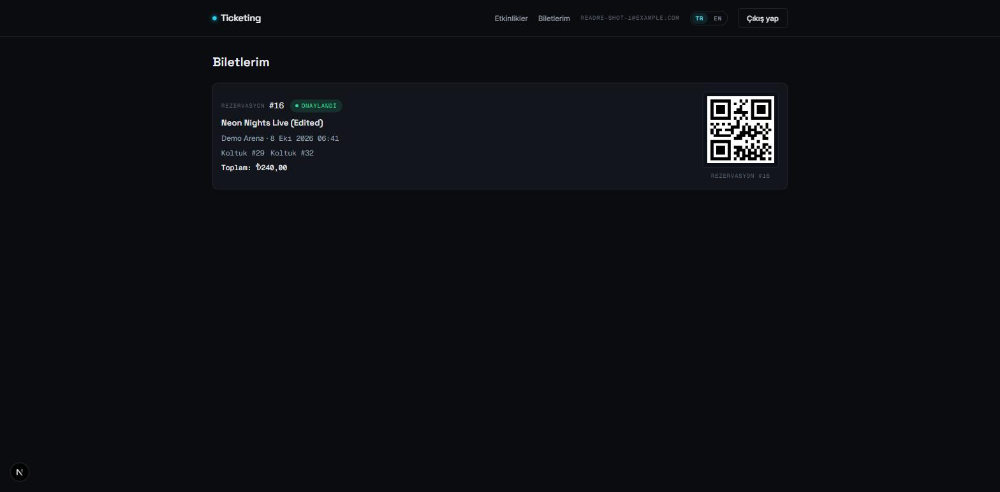

# Ticketing Platform

Event ticketing sistemi (etkinlik ara → koltuk seç → öde → bilet al) — mikroservis mimarisiyle
kurulmuş, **~%80'i Claude Code ile geliştirilmiş** bir interview showcase projesi.

## Neden bu proje seçildi

- Amaç bir dağıtık sistem mülakat vitrine: **eşzamanlılık** (aynı koltuğa yarışan kullanıcılar),
  **saga orkestrasyonu** (ödeme akışı, çoklu servis), **eventual consistency** (Kafka üzerinden
  asenkron state geçişleri) ve **servis sınırları** (shared DB yok, cross-service REST yok) gibi
  konuları somut şekilde göstermek gerekiyordu.
- "Bilet satın al" senaryosu herkesin sezgisel olarak anladığı bir domain — bu da mimari
  kararların (neden koltuk state'i booking'de, neden event'te değil; neden HMAC JWT; neden
  idempotent consumer) hakemin gözünde kolayca değerlendirilebilir olmasını sağlıyor.
- Tek bir "vertical slice" (register → browse → hold → pay → confirm + notification) uçtan uca
  ve gerçek timeout/hata yollarıyla çalışır durumda; yarım bırakılmış geniş kapsam yerine derinlik
  tercih edildi.

## Kullanılan teknolojiler

**Backend**
- Java 21, Spring Boot 3.x, Maven (multi-module reactor)
- Spring Cloud Gateway (edge routing, JWT validation)
- Resilience4j (circuit breaker + timeout + retry, sadece gateway'de)
- Apache Kafka (async event/komut akışı, saga orkestrasyonu)
- PostgreSQL — servis başına ayrı veritabanı, shared schema yok
- Redis — koltuk hold'ları (TTL'li), distributed lock

**Frontend**
- Next.js (App Router, TypeScript), pnpm, Tailwind

**Test**
- JUnit 5 + Testcontainers (backend integration)
- Vitest (unit) + Playwright (E2E, frontend)

**Observability**
- OpenTelemetry Java agent (auto-instrumentation, her serviste `-javaagent`) → Elastic APM Server
  (OTLP ingest) → Elasticsearch → Kibana. Gerçek trace'ler üretiliyor ve doğrulandı (Elasticsearch'e
  ulaşan bir Postgres JDBC span'i, `service.name`/`service.namespace` alanlarıyla).
- Her serviste `logback-spring.xml` + `logstash-logback-encoder` ile yapılandırılmış JSON console
  log (MDC üzerinden trace_id/span_id korelasyonuna hazır).
- Not: bu iki madde projenin ilk halinde sadece dokümanda vardı, kodda hiçbir iz yoktu — bir audit
  bunu yakaladı, ardından gerçekten uçtan uca kuruldu (docker-compose'a `elasticsearch`/`kibana`/
  `apm-server` eklendi, her serviste OTel agent + JSON logging wiring yapıldı). Şeffaflık için
  burada not ediliyor.

## Ekran görüntüleri

Yerel stack'ten alınan gerçek ekran görüntüleri (i18n, saga akışının uçtan uca çalışan hali):

| Etkinlik kataloğu (TR) | Etkinlik kataloğu (EN, i18n) |
|---|---|
|  |  |

| Etkinlik detayı | Koltuk seçimi (hold + TTL geri sayım) |
|---|---|
|  |  |

| Rezervasyon onaylandı (saga tamamlandı) | Bilet (QR kod) |
|---|---|
|  |  |

## Mimari / workflow akışı

```
                        ┌──────────────┐
                        │   Frontend   │  Next.js (3000)
                        └──────┬───────┘
                               │ REST (tek giriş noktası)
                        ┌──────▼───────┐
                        │   Gateway    │  JWT validation + Resilience4j (8080)
                        └──────┬───────┘
              ┌────────────────┼────────────────┬───────────────┐
              ▼                ▼                 ▼               ▼
          ┌───────┐       ┌───────┐         ┌─────────┐    ┌──────────┐
          │ auth  │       │ event │         │ booking │    │ payment  │
          │ 8081  │       │ 8082  │         │  8083   │    │  8084    │
          └───────┘       └───────┘         └────┬────┘    └────┬─────┘
       (JWT issuer)   (venue/seat/    (seat availability,        │
                        pricing         holds, SAGA               │
                        katalog)        orchestrator)              │
                                            │                       │
                                            │  1. hold seats (Redis, TTL)
                                            │  2. PaymentRequested
                                            ▼
                                    payment.commands ─────────────▶ payment
                                                                       │
                                                        PaymentCompleted /
                                                        PaymentFailed
                                                                       │
                                    payment.events  ◀──────────────────┘
                                            │
                                    booking consumer:
                                    - Completed → SOLD, CONFIRMED, BookingConfirmed
                                    - Failed    → release hold, CANCELLED, BookingCancelled
                                    - TTL timeout → sweep job cancels + releases
                                            │
                                    booking.events
                                            ▼
                                    ┌──────────────┐
                                    │ notification │  8085 (consumer-only, no REST)
                                    └──────────────┘
```

Servisler birbirine asla doğrudan REST ile bağlanmaz, birbirinin veritabanını okumaz/yazmaz.
Cross-service iletişim tamamen Kafka üzerinden; senkron trafik sadece client → gateway → servis
yönünde.

### Veri modeli ve akışla ilişkisi

Her servis kendi Postgres şemasını yönetir (Flyway, `db/migration`); id'ler servisler arası
sadece "foreign id" olarak taşınır, gerçek FK hiçbir zaman sınırı geçmez.

- **auth** — `users(email, password_hash)`, `roles`, `user_roles` (many-to-many). Sadece JWT
  üretir; kullanıcı adı/kimliği token'ın `sub`/`roles` claim'lerinde taşınır.
- **event** — `venues(name, address, city)` → `events(venue_id, title, starts_at, status)` →
  `seat_categories(event_id, name, price, section)` ve `seats(venue_id, section, row_label,
  seat_number)`. Koltuk fiziksel olarak **venue**'ye bağlıdır (etkinlikler arası tekrar kullanılır);
  fiyat tier'ı `section` üzerinden event'e bağlanır. Bu tablolarda satış/hold durumu **yoktur** —
  bilinçli olarak (ADR-0001).
- **booking** — `bookings(user_id, event_id, status, total, expires_at)` →
  `booking_items(booking_id, seat_id, price)` (fiyat hold anında snapshot'lanır, sonradan
  yeniden hesaplanmaz), `seat_availability(event_id, seat_id, status)` (AVAILABLE/HELD/SOLD —
  Redis TTL lock'un kalıcı yansıması) ve `saga_state(booking_id, step, status)` (saga'nın crash
  sonrası kurtarılabilmesi için).
- **payment** — `payments(booking_id, amount, status, provider_ref)` + `processed_messages` (Kafka
  idempotency ledger'ı).
- **notification** — `notifications(type, recipient, channel, status, payload)` + kendi
  `processed_messages` ledger'ı.

Akışla eşleşme:

1. Kullanıcı etkinliği seçer → event-service'in `events` / `seat_categories` / `seats`
   tablolarından statik koltuk haritası + fiyat döner.
2. Koltuk seçilince booking-service devreye girer: Redis'te `eventId:seatId` lock + TTL alınır,
   `seat_availability` satırı `HELD` yapılır, mevcut `PENDING` `bookings` satırına `booking_items`
   eklenir (ADR-0004 — tek booking'e append, yeni booking değil).
3. Checkout'ta booking `saga_state`'i günceller, `payment.commands`'e yayınlar; payment kendi
   `payments` satırını `PENDING → COMPLETED/FAILED` çevirir.
4. Sonuç booking'e döner: `Completed` → `seat_availability` `SOLD`, `bookings.status`
   `CONFIRMED`; `Failed`/timeout → hold serbest, `bookings.status` `CANCELLED`/`EXPIRED`.
5. notification, `booking.events`'i tüketip kendi `notifications` satırını yazar — booking'in
   hiçbir tablosuna dokunmadan.

## Karşılaşılan problemler ve çözümler

- **Koltuk state'i nerede tutulmalı (event vs booking)** — event servisine yazılsaydı booking
  checkout esnasında event'in veritabanına yazmak zorunda kalır ve yüksek eşzamanlılık gerektiren
  hold/sell trafiği düşük yazımlı katalog verisiyle aynı store'a girerdi. Karar: availability
  state tamamen **booking**'de (`seat_availability` + Redis TTL lock), event sadece statik seat
  map'i tutar (ADR-0001).
- **JWT doğrulama stratejisi** — tek issuer (auth), tek trust domain (Compose ağı) olduğu için
  RS256/JWKS'in getirdiği key-rotation/JWKS-endpoint karmaşıklığı gereksizdi. Karar: paylaşılan
  HMAC secret (HS512), riskleri (signing gücünün her validator'da olması) ADR'de açıkça not
  edilerek kabul edildi; RS256'ya geçiş yolu tanımlı (ADR-0002).
- **Kafka DTO drift'i** — payment/booking/notification kendi kopya DTO'larını tutsaydı bir alan
  rename'i sessizce runtime'da null/kaybolan veri olarak ortaya çıkardı. Karar: paylaşılan
  `messaging` Maven modülü — compile-time'da drift'i derleme hatasına çeviriyor (ADR-0003).
- **Kısmi koltuk hold'ları ve UX uyumsuzluğu** — `POST /bookings/hold` her çağrıda yeni bir
  `Booking` oluşturuyordu, bu da frontend'i tüm seçimleri tek seferde batch'lemeye zorlayıp
  per-click countdown/race-toast deneyimini bozuyordu. Fix: mevcut `PENDING` booking'e ekleme
  (append) yapılıyor, max-6-koltuk kuralı kümülatif kontrol ediliyor (ADR-0004).
- **Idempotent consumer'larda claim-before-work sırası hatası** — `SagaCompletionService`,
  payment ve notification'ın hepsinde mesaj claim'i iş mantığından *önce* commit ediliyordu; iş
  mantığı ortada patlarsa mesaj kalıcı olarak "işlendi" işaretleniyor ama hiçbir şey gerçekleşmemiş
  oluyordu (booking `PENDING`/seat `HELD` sonsuza kadar takılı kalıyordu). Fix: claim, işin
  transaction commit'inden *sonra* (`afterCommit` hook, `REQUIRES_NEW` + ayrı `TransactionTemplate`)
  işaretleniyor — üç servis için de aynı desene çekildi (ADR-0005).
- **Aynı topic'te birden fazla mesaj tipi** — `payment.events` hem `PaymentCompletedEvent` hem
  `PaymentFailedEvent` taşıyor; tek `ConsumerFactory`/group-id ile paylaşmak partition rebalance
  sonrası sadece bir listener'ın mesaj almasına yol açıyordu. Fix: her tip için ayrı listener, ayrı
  consumer group id, `__TypeId__` header'ına göre filtreleyen `RecordFilterStrategy` (ADR-0005).
- **Gateway CORS ve race-condition fix'leri** — pending-booking race'i, gateway'de duplicate CORS
  header'ı ve saga idempotency claim sıralaması bir review geçişinde birlikte tespit edilip
  düzeltildi (bkz. `2455d31`, `7d67ccc` commit'leri) — code-review agent'ının pratikte iş gördüğü
  bir örnek.

## AI ile nasıl geliştirildi

Proje Claude Code ile, mikroservis sınırlarını yansıtan **özel subagent'lar** ve proje-seviyesi
**skill'ler** üzerinden geliştirildi. Yaklaşım: her bounded context / kaygı için ayrı bir uzman
agent, genel amaçlı tek bir agent'a her şeyi yaptırmak yerine.

**Özel subagent'lar** (`.claude/agents/*.md`)

| Agent | Rol |
|---|---|
| `backend-architecture` | Servis sınırı/katman kararları, salt-okunur danışman |
| `backend-service` | Spring Boot servis implementasyonu (entity/repo/controller/test) |
| `saga-orchestrator` | Booking'in checkout saga'sı — idempotency, timeout sweep, outbox |
| `message-broker` | Kafka topic/producer/consumer/DLQ altyapısı |
| `gateway-resilience` | Gateway route/JWT/Resilience4j konfigürasyonu |
| `frontend` / `frontend-architecture` | Next.js implementasyonu / route-state mimarisi |
| `ui-designer` | Sadece görsel restyling, iş mantığına dokunmaz |
| `figma-screen-design` | Ekran/wireframe spesifikasyonu, mockup |
| `docker-infra` / `app-runner` | Compose/Dockerfile sahipliği / stack'i çalıştırma-durdurma |
| `code-reviewer` / `domain-review` | Kod kalitesi review / domain doküman tutarlılığı review |
| `workflow-rules` | İş kuralları, state machine'ler, ADR taslağı |
| `performance-engineer` | N+1, lock contention, Kafka lag, pool sizing |
| `brainstorm-analyst` | Yeni istek geldiğinde kapsamı netleştirme (implementasyondan önce) |
| `progress-keeper` | `docs/memory.md` — oturumlar arası ilerleme kaydı |

**Proje-seviyesi skill'ler** (`.claude/skills/*/SKILL.md`) — ilgili agent'ın izlediği somut
prosedürü tanımlar: `backend-architecture`, `frontend-architecture`, `docker-infra`,
`domain-review`, `workflow-rules`, `progress-keeper`, `run-ticketing-platform` (yerel stack'i
başlatma/durdurma runbook'u).

**Superpowers plugin** — brainstorming, systematic-debugging, test-driven-development,
writing-plans, code-review gibi genel disiplin skill'lerini sağlayan paylaşılan bir skill paketi
(proje-agnostik). Rolü: implementasyondan önce brainstorm zorunluluğu, TDD akışı ve yapılandırılmış
code review adımlarını dayatmak — proje-özel agent'lar bu skill'leri sarmalayıp üzerine domain
kuralları ekliyor.

**Hook'lar** (`.claude/settings.json`)
- `SessionStart` — `docker compose ps` çalıştırıp yerel infra durumunu oturum başında gösterir.
- `PostToolUse` (Edit/Write) — `frontend/` altında değişiklik varsa `tsc --noEmit` ile anında
  typecheck (hızlı feedback döngüsü).
- `PreToolUse` (Bash, `git commit` öncesi) — staged frontend değişikliği varsa `pnpm lint` +
  `tsc --noEmit` çalıştırır; bozuk frontend kodunun commit edilmesini engeller.

**MCP** — `.mcp.json` içinde `git-mcp` (`@cyanheads/git-mcp-server`) tanımlı; yapılandırılmış git
operasyonları için bağlı.
